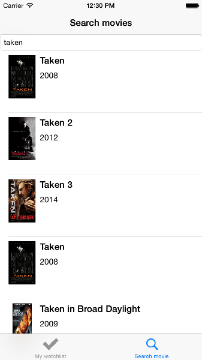

# My-Movies
A basic iOS app developed in Swift which is able to search movies (omdbapi) and add them to a watchlist. When the movies are watched the user can rate the movie.
## Some screenshots

search for a movie or serie using the OMDBAPI

View detailed movie/serie info and ability to add to watchlist

View watchlist with the ability to delete items using swipe left

Rate a movie after you watched it
